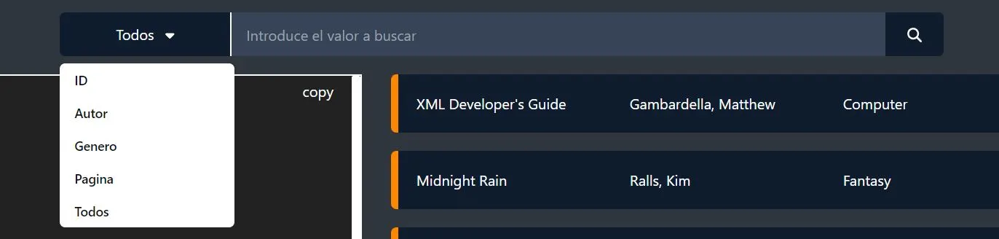
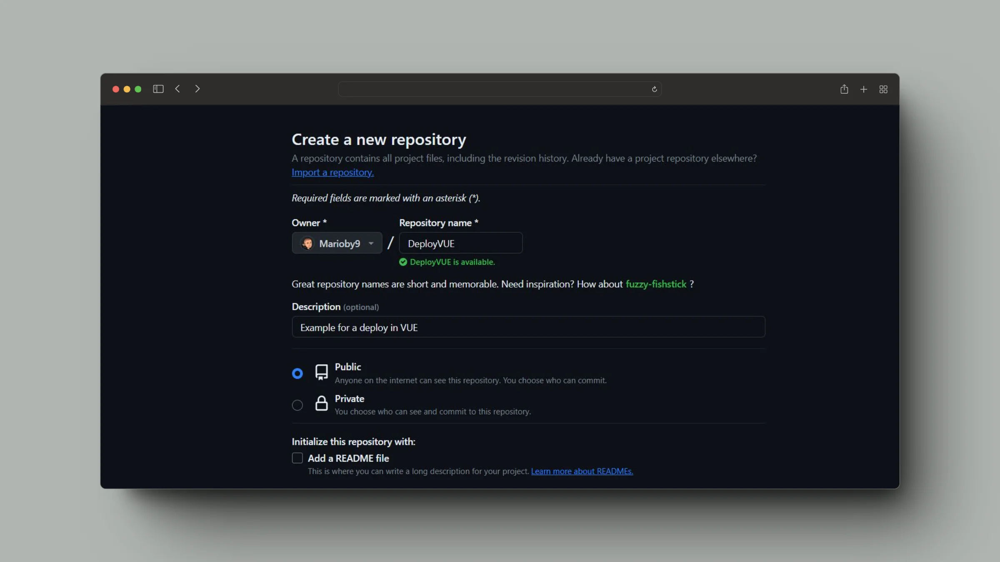
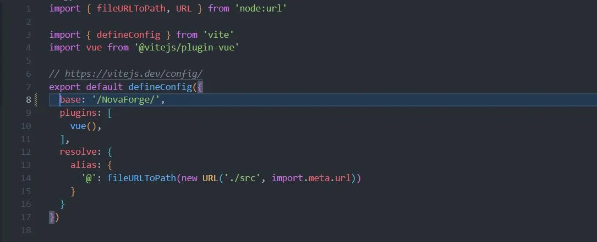
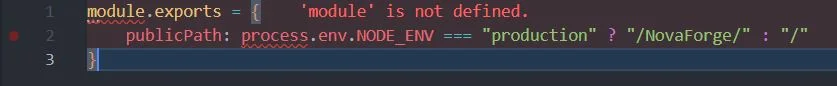
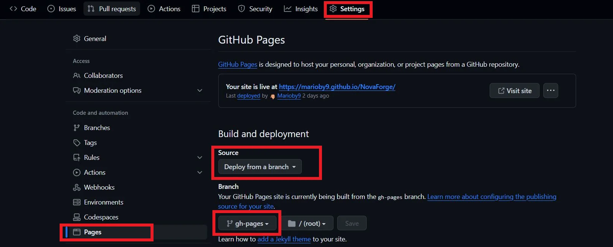
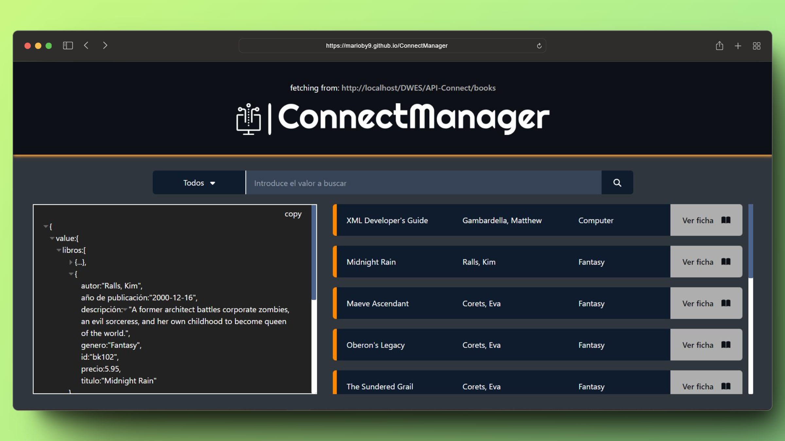

<a name="readme-top"></a>

<br />
<div align="center">
  
  <br>
  <p align="center">
    Componente para consumición de API REST.
  </p>
</div>

<!-- TABLA DE CONTENIDO -->
<details>
  <summary>Tabla de contenido</summary>
  <ol>
    <li>
      <a href="#resumen">Resumen</a>
      <ul>
        <li><a href="#características-principales">Características Principales<a></li>
      </ul>
    </li>
    <li><a href="#requisitos-previos">Requisitos previos</a></li>
    <li><a href="#instalación">Instalación</a></li>
    <li><a href="#despliegue">Despliegue</a></li>
    <li><a href="#demostración">Demostración</a></li>
    <li><a href="#contribuye">Contribuye</a></li>
    <li><a href="#licencia">Licencia</a></li>
    <li><a href="#contacto">Contacto</a></li>
    <li><a href="#agradecimiento">Agradecimiento</a></li>
  </ol>
</details>

<!-- EMPEZAMOS -->

## Resumen

Bienvenido a ConnectManager, una plataforma online para visualizar el contenido de tu API REST favorita. Obtén el resultado de tus peticiones con o sin parámetros. Copia la estructura JSON resultante de la petición. 
- En ConnectManager, podrás realizar peticiones a tu API con o sin parámetros mediante un buscador con filtro modificable a tu gusto.
- Podrás comprobar los resultados obtenidos en tus peticiones con una interfaz agradable, además de copiar la estructura JSON del contenido devuelto.

### Características Principales:
- **Peticiones a API:** Modifica la URL a la que solicitas y realiza peticiones.
- **Filtrar por parámetros:** Realiza peticiones parametrizadas usando nuestro filtro.
- **Visualiza el contenido:** Podrás ver toda la información obtenida de cada elemento en una interfaz intuitiva y agradable.
- **Observa la estructura:** Comprueba la estructura de datos obtenida en la petición en un visor JSON. Podrás expandir y reducir el contenido. Además, podrás copiar toda la estructura al portapapeles.
- **Interfaz Intuitiva:** Una interfaz de usuario amigable que facilita la navegación y el uso de las funcionalidades de la aplicación.

Este proyecto busca proporcionar una aplicación sencilla y fácil de usar para que un usuario estándar pueda realizar peticiones a una API y observar su contenido de una manera cómoda e intuitiva.

Siéntete libre de explorar, contribuir y adaptar este proyecto según tus necesidades específicas. ¡Disfruta de tu experiencia en ConnectManager!

## Requisitos previos

Antes de comenzar con la instalación, asegúrate de tener instalado un entorno de desarrollo en tu sistema. También debes tener instalado y configurado Git en tu sistema. 

## Instalación

Sigue estos pasos para configurar el proyecto en tu entorno local:

1. **Clonación del repositorio de GitHub:**

   - Copia la dirección de este repositorio e introduce el siguiente comando para clonar el repositorio a tu equipo local:
    ```bash
    git clone https://github.com/Marioby9/ConnectManager.git
    ```

2. **Acceder al directorio del proyecto:**

   - Una vez ya te has traído todos los archivos del repositorio a tu equipo, debes moverte a la carpeta del directorio creado.
   ```bash
   cd ConnectManager
   ```

3. **Instalación de las dependencias:**

   - En los archivos `package.json` y `package-lock.json` se encuentran las dependencias ya definidas. Este fichero no debe editarse.
   - Introduce el siguiente comando para instalar las dependencias:

    ```bash
    npm install
    ```

4. **Modificación de API Config:**
  En la carpeta config de este repositorio, encontrarás un fichero APIConfig.js. Este fichero es la base de todo el proyecto y de su usabilidad. Deberás modificar estos parámetros a tu gusto. <br>
  En API_URL introducirás la url completa de tu API REST. TABLE sería el valor al que quieres acceder. Por último FILTERS es una lista con los parámetros mediante los que realizarás las peticiones. Estos parámetros serán utilizables en el filtro de la página:

   - Modifica los parámetros en ./src/config/APIConfig.js

   - Comprueba que la aplicación obtiene resultados.

   - Modifica los filtros a tu gusto para que sean utilizables en el filtro de la web.
   <br>
   ```javascript
    //YOU MUST MODIFY THIS PARAMS WITH YOUR API
    export const API_URL = "http://localhost/DWES/API-Connect/books"
    export const TABLE = "books"
    export const FILTERS = ['ID' , 'Autor', 'Genero', 'Pagina', 'Todos']
   ```
   <br><br>

5. **Lanzamiento de la aplicación en local:**
    - Utiliza esta opción si estás desarrollando la aplicación.
    - Introduce el siguiente comando para desplegar tu proyecto en local:

    ```bash
    npm run dev
    ```
    - NPM acaba de abrir un puerto en tu equipo para alojar la aplicación en local.


Ahora deberías poder acceder a tu proyecto a través de [http://localhost.com:5050]() (Por ejemplo) en tu navegador. Asegúrate de que las variables en los archivos de configuración de API sean correctos, reciban respuesta y no obtengan error de CORS.

¡Listo! Tu entorno local está configurado para ejecutar el proyecto de página web en VUE con las variables globales personalizadas y datos de prueba. ¡Feliz desarrollo!

<p align="right">(<a href="#readme-top">Volver arriba</a>)</p>

<!-- DESPLIGUE -->
## Despliegue

Si lo deseas, puedes desplegar tu proyecto VUE, en este caso tu modificación de NovaForge. Para poder desplegar tu aplicación web VUE debes seguir los siguientes pasos: 

1. **Crear repositorio en GitHub:**
   - Crea un nuevo repositorio para alojar todo el código de tu proyecto en GitHub:
     - El nombre que quieras
     - La descripción que quieras
     - Debe tener visibilidad pública

  <br>

2. **Modificar los archivos vite.config.js y vue.config.js:**
   - Debes modificar el fichero vite.config.js de tu proyecto indicando la ruta base de despliegue:

  <br>
  - Debes crear el fichero vue.config.js de tu proyecto y añadir las siguientes líneas (ignora errores):

  <br>

3. **Conectar repositorio a tu proyecto local:**
   - Conecta tu repositorio remoto con tu repositorio local:
  ```bash
  git init
  git add .
  git commit -m "First Commit"
  git remote add origin tuRepositorio.git
  git branch -M main
  git push -u origin main
  ```

4. **Generar carpeta dist lista para despliegue:**
   - Esta carpeta será la que convierta los archivos de tu proyecto VUE a archivos .html y .js legibles por un servidor de despliegue:
   - Los siguientes comandos subirán el contenido de dicha carpeta a una rama de despliegue llamada gh-pages.
  ```bash
  npm run build
  ```
  ```bash
  git add dist -f
  git commit -m "deploy: 🚀 DEPLOY"
  git subtree push --prefix dist origin gh-pages
  ```
5. **Indicar rama gh-pages en GitHub:**
   - En tu repositorio:
      - Accede a settings
      - Accede a Pages
      - Selecciona en source: Deploy from a branch
      - Como rama selecciona la rama gh-pages desde la raíz

  <br>
  
6. **Espera y accede a tu web:**
   - Tardará unos minutos en desplegarse
   - El link será: https://tuUsuario.github.io/tuRepositorio/
   - Disfruta de tu web VUE desplegada


<p align="right">(<a href="#readme-top">Volver arriba</a>)</p>


## Demostración

Aquí tienes una demostración previa de cómo se vería la aplicación, en caso de que haya recibido respuesta a las peticiones, todos los parámetros estén correctamente configurados y todas las dependencias estén instaladas.

<br>
      
<!-- CONTRIBUYE -->
## Contribuye

Las contribuciones son las que hacen de la comunidad de código abierto un lugar increíble para aprender, inspirar y crear. Cualquier contribución que hagas será muy apreciada.

Si tiene alguna sugerencia que pueda mejorar esto, bifurque el repositorio y cree una pull request. También puedes simplemente abrir un problema con la etiqueta "mejora". ¡No olvides darle una estrella al proyecto! ¡Gracias de nuevo!

<p align="right">(<a href="#readme-top">Volver arriba</a>)</p>

<!-- LICENCIA -->

## Licencia

Distribuido bajo la licencia Apache License 2.0. Consulte `LICENCIA.txt` para obtener más información.

<p align="right">(<a href="#readme-top">Volver arriba</a>)</p>

<!-- CONTACTO -->

## Contacto

Mario Martín Godoy - [@mariomg]() - mmartin.mrmg@gmail.com

Enlace del proyecto: [https://github.com/Marioby9/ConnectManager](https://github.com/Marioby9/ConnectManager)

<p align="right">(<a href="#readme-top">Volver arriba</a>)</p>

<!-- AGREDECIMIENTO -->

## Agradecimiento

Las páginas que he utilizado para obtener documentación del proyecto son las siguientes:


- [TailwindCSS](https://tailwindcss.com/)
- [VUE](https://vuejs.org/)
- [Deploy VUE GH-PAGES](https://learnvue.co/articles/deploy-vue-to-github-pages)
- [Better GH commits](https://alvarovalverde.dev/blog/write-better-git-commit-messages)

<p align="right">(<a href="#readme-top">Volver arriba</a>)</p>
